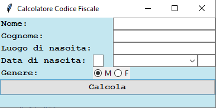
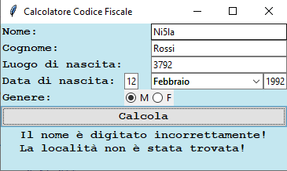
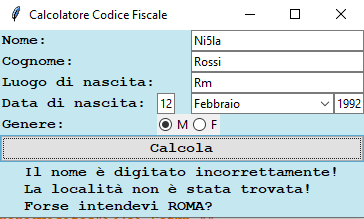
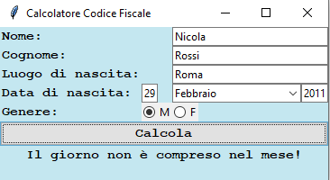

# Fiscal Code Calculator - Desktop Application #
Simple Fiscal Code Calculator. I used this project to learn mainly regular expressions (for checking inputs) and Graphical Interfaces Logic (using Tkinter).
This was developed during a course on introduction to programming using Python, for didactic purposes. 

Here's what it looks like:

# Table of Contents #
1. [Technologies](#technologies)
2. [Prerequisites](#prerequisites)
3. [Features](#features)
4. [Project Status](#status)
5. [Source](#source)

## Technologies  

* **Python 3.6.0**
* **Tkinter 8.6**
* **Calendar 1.11.4**
* **Regex 2021.11.10**
* **Levenshtein 0.16.0**
* **Unidecode 1.3.2**
* **DateTime 4.3**

## Setup  

There is no particular prerequisite to run the Fiscal Code Calculator. The application is OS-independent and uses minimal resources, being written in Tkinter, which is native to Python.

## Functionalities  

The application includes a system to check the correcteness of user input by means of regular expression (No numbers on name inputs, and so on), displaying error messages to the user.
Below is an example of incorrect digited inputs:

Also, by means of Levenshtein library, i implemented an algorithm to find the closest approximation of the user's birth place, when it is inserted incorrectly. For example:

Finally, the fiscal code calculator is capable of determining a leap year, thus checking the date by means of the calendar module. Here's an example of a fiscal code calculated in 2011 (non-leap year) in the 29th of February:

## Project Status  

Currently, i have no plan to develop the project further. However i am planning to re-build the fiscal code calculator using another GUI library, namely Kivy, to explore its functionalities and features.

## Source  

As i mentioned before, i was inspired to build this application as part of a task during an introductory course on Python.
The task was to calculate certain characters in the fiscal code through console input and output.

